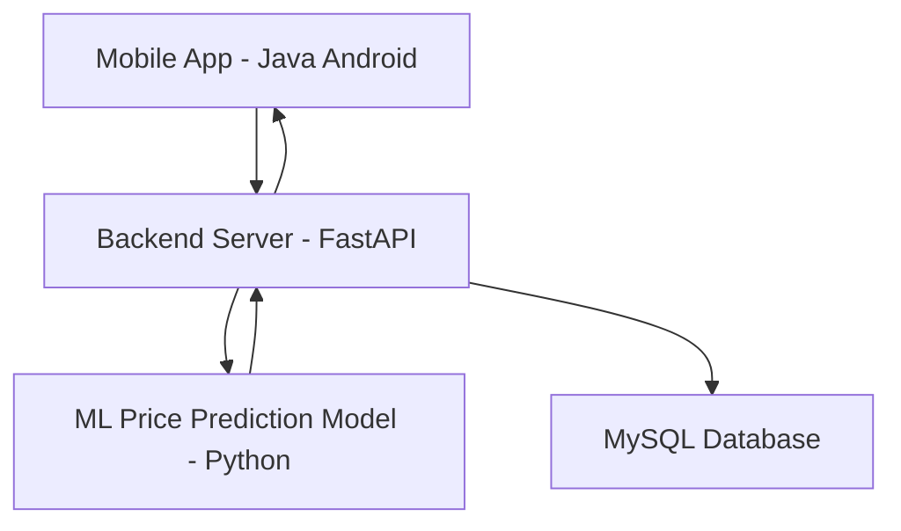

# 🌾 Smart Krishi App

## 📌 Overview
**Smart Krishi App** is a digital marketplace designed for **farmers and vendors in Bangladesh** to buy and sell agricultural products at **fair market prices**.  
The app integrates a **Machine Learning–based crop price prediction model** to help farmers make informed selling decisions based on **market trends and seasonal demand**.

Our goal is to reduce price exploitation and ensure farmers receive the value they truly deserve for their crops.

---

## 🎯 Target Users
- 👨‍🌾 Farmers  
- 🏪 Vendors  

---

## ✨ Key Features
- 📈 **Crop Price Prediction** using Machine Learning  
- 🤝 Fair price transparency for farmers  
- 📱 Mobile-friendly application  
- ⚡ Fast and scalable backend with API-based architecture  
- 🗄 Secure database for product and price data  

---

## 🛠 Tech Stack
- **Mobile App Development:** Java  
- **Backend API:** FastAPI (Python)  
- **Machine Learning:** Python  
- **Database:** MySQL  

---

## 🧠 Machine Learning Model
- **Purpose:** Predict crop prices for farmers  
- **Prediction Factors:**
  - Historical market prices  
  - Seasonal demand  
  - Market trends  
- **Benefit:** Helps farmers decide *when* and *at what price* to sell their crops

---

## 🏗 System Architecture

## 🚀 Future Improvements

- Real-time market price updates
- Weather-based price prediction
- User authentication & role management
- Admin dashboard for monitoring trends

## 🙌 Acknowledgements

- Farmers and vendors of Bangladesh
- Open-source libraries and datasets used for ML development
